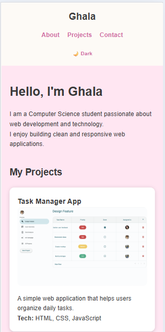
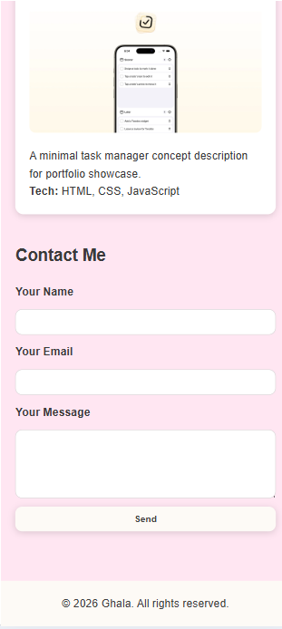

# 202266180 – Ghala Badr – Assignment 1

## Project Overview

This project is a responsive personal portfolio website built using HTML5, CSS3, and JavaScript.

It showcases my background, selected projects, and includes a contact interface.  
The website demonstrates structured front-end development, accessibility awareness, responsive layout design, and responsible AI-assisted development practices.

## Features

- About Me section
- Projects showcase (2 portfolio examples)
- Responsive layout (mobile, tablet, desktop)
- Dark / Light mode toggle
- Theme preference saved using localStorage
- Automatic detection of system color scheme
- Accessible front-end form validation
- Smooth scrolling navigation

## Technologies Used

- HTML5
- CSS3 (Flexbox, Grid, Media Queries, CSS Variables)
- JavaScript (DOM manipulation, localStorage, matchMedia)

## Technical Implementation

### Theme System

Dark mode is implemented by applying a class to the `<html>` element.  
Theme colors are controlled using CSS variables for easier maintenance.

User preference is stored using localStorage.  
If no stored theme exists, the system checks the user’s device preference using `prefers-color-scheme`.

The toggle button updates:
- Text label
- aria-pressed state
- aria-label

### Responsive Design

The layout uses:
- CSS Grid for project cards
- Flexbox for navigation and form layout
- Media query at max-width: 600px

On smaller screens:
- Navigation stacks vertically
- Project grid becomes single column
- Form expands to full width

### Accessibility Improvements

- Semantic HTML elements (main, section, article)
- Skip-to-content link
- Visible focus styles
- ARIA attributes for interactive elements
- Support for reduced motion preference

### Contact Form

The form includes front-end validation only.  
Submission is prevented if fields are empty.  
A status message is displayed using `aria-live` for accessibility.

## Project Structure

project-folder/  
│── index.html  
│── css/styles.css  
│── js/script.js  
│── docs/ai-usage-report.md

## How to Run

1. Download or clone the repository.
2. Open the project folder.
3. Open index.html in your browser.
4. No installation required.

## Browser Compatibility

Tested on:
- Google Chrome
- Mozilla Firefox
- Microsoft Edge

## AI Usage Summary

AI tools were used to:
- Refactor the theme toggle logic
- Improve CSS structure using variables
- Enhance accessibility implementation
- Optimize responsive layout

All AI-generated suggestions were reviewed, modified where necessary, and tested before integration.

Detailed documentation is available in docs/ai-usage-report.md.
## Screenshots

## Live Demo
The project is deployed using GitHub Pages:
[Live Preview Link]
## Known Limitations
- Contact form does not connect to a backend server.
- AI enhancement feature is a simulated prototype.
## Future Improvements
- Backend integration for contact form
- Add more portfolio projects
- Improve animation micro-interactions
